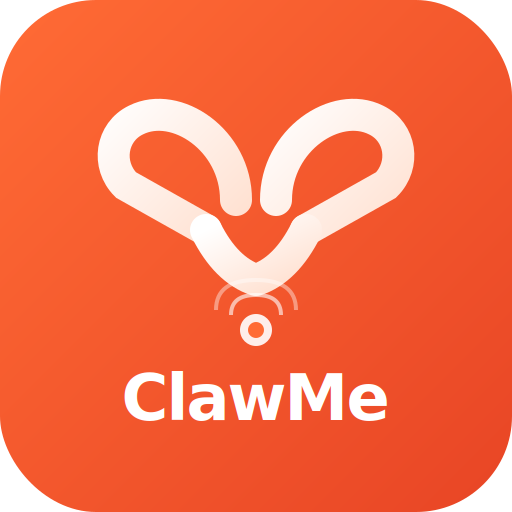

<p align="center">
  
</p>

<h1 align="center">ClawMe / 虾me</h1>

<p align="center">
  <b>The execution layer between AI Agents and your devices</b><br>
  AI Agent 与你的设备之间的执行层
</p>

<p align="center">
  <a href="https://clawme.net">Website</a> ·
  <a href="#quick-start">Quick Start</a> ·
  <a href="#中文说明">中文说明</a> ·
  <a href="docs/instruction-protocol.md">Protocol</a>
</p>

---

## What is ClawMe?

AI Agents can think, plan, and decide — but they **can't** directly tap buttons, fill forms, or send messages on your devices. ClawMe bridges that gap.

**Agent sends structured instructions → ClawMe delivers to your browser/phone → You confirm and execute (or auto-execute).**

Not replacing you, but executing for you. A butler, not a boss.

## Features

| Feature | Description |
|---------|-------------|
| **7 instruction types** | remind, open_url, compose_tweet, compose_email, fill_form, click, extract |
| **Browser extension** | Chrome side panel with auto-polling, desktop notifications, badge |
| **Mobile PWA** | Add to home screen, scan QR to connect, chat with your Agent |
| **Multi-step Workflows** | Chain instructions with `workflow_id`, progress visualization |
| **Semi-automatic** | You confirm before executing (or enable auto-execute) |
| **Dark mode** | Follows system preference |
| **Agent-agnostic** | Works with OpenClaw, custom agents, or any HTTP-capable AI |
| **Open source** | AGPL-3.0 — free for individuals, protected against cloud freeloading |

## Architecture

```
┌─────────────┐       ┌─────────────────┐       ┌──────────────────┐
│  AI Agent   │──────→│  ClawMe Backend │←──────│  Browser Ext     │
│  (OpenClaw) │ POST  │  (your VPS)     │ poll  │  Mobile PWA      │
│             │       │                 │       │  (clawme.net)    │
└─────────────┘       └─────────────────┘       └──────────────────┘
                              ↑
                      User messages (chat)
```

## Quick Start

### 1. Start the backend

```bash
cd backend && npm install && npm run build && npm start
```

### 2. Load the browser extension

1. Open `chrome://extensions` → Enable Developer mode
2. Click "Load unpacked" → Select the `extension/` directory
3. Click the ClawMe icon → Side panel opens
4. Enter Backend URL (`http://127.0.0.1:31871`) and Token → Save

### 3. Send a test instruction

```bash
curl -X POST http://127.0.0.1:31871/v1/instructions \
  -H "Content-Type: application/json" \
  -H "X-ClawMe-Token: test" \
  -d '{"target":"browser","instruction":{"type":"remind","payload":{"title":"Hello","body":"ClawMe works!"}}}'
```

### 4. Connect OpenClaw

Install the [OpenClaw plugin](openclaw-clawme/) and configure:

```
baseUrl: http://127.0.0.1:31871   (or https://clawme.net)
clientToken: your-token
```

## Deploy to Production

**Website (Vercel):** Import this repo, set root directory to `web/`

**Backend (VPS):**
```bash
ssh root@your-server 'bash -s' < deploy/setup.sh
```

See [deploy/](deploy/) for Nginx config and PM2 setup.

## Project Structure

```
backend/          Node.js API server (Express + TypeScript)
extension/        Chrome extension (Manifest V3, side panel)
web/              Landing page + PWA mobile app
deploy/           VPS deployment scripts (Nginx, PM2, SSL)
openclaw-clawme/  OpenClaw agent plugin
docs/             Protocol spec, architecture, guides
```

## License

[AGPL-3.0](LICENSE) — Free for everyone. If you modify and run it as a service, you must open-source your changes.

---

# 中文说明

## ClawMe 是什么？

AI Agent 能想、能决策，但**不能**直接在你的手机、浏览器上点按钮、填表单、发消息。ClawMe 就是这个桥梁。

**Agent 发结构化指令 → ClawMe 送到你的浏览器/手机 → 你确认后执行（或自动执行）。**

不替你做主，但替你动手。管家角色。

## 核心功能

- **7 种指令**：提醒、打开链接、发推、写邮件、填表单、点击元素、抓取内容
- **浏览器插件**：Chrome 侧边栏，自动轮询 + 桌面通知 + badge 计数
- **手机 PWA**：添加到主屏幕，扫码连接，和 Agent 对话
- **多步骤 Workflow**：一组指令按顺序自动执行，支持进度条和中止
- **半自动执行**：你确认后再执行，也可开启自动模式
- **暗色模式**：跟随系统
- **不绑定特定 Agent**：OpenClaw、自研 Agent 或任何 HTTP 接口都能接入

## 快速开始

### 1. 启动后端

```bash
cd backend && npm install && npm run build && npm start
```

### 2. 加载浏览器插件

1. 打开 `chrome://extensions` → 开启「开发者模式」
2. 「加载已解压的扩展程序」→ 选择 `extension/` 目录
3. 点图标打开侧边栏 → 填 URL 和 Token → 保存

### 3. 发测试指令

```bash
curl -X POST http://127.0.0.1:31871/v1/instructions \
  -H "Content-Type: application/json" \
  -H "X-ClawMe-Token: test" \
  -d '{"target":"browser","instruction":{"type":"remind","payload":{"title":"测试","body":"ClawMe 工作了！"}}}'
```

### 4. 连接 OpenClaw

安装 [OpenClaw 插件](openclaw-clawme/)，配置 `baseUrl` 和 `clientToken`。

## 部署

**网站**：Vercel 导入本仓库，Root Directory 设为 `web/`

**后端**：
```bash
ssh root@你的服务器 'bash -s' < deploy/setup.sh
```

## 产品定位

- **问题**：Agent 和你的设备之间缺一个「管家」
- **Telegram/Discord**：只能传消息和 URL，不能传可执行的操作
- **ClawMe**：传的是**结构化可执行指令**，在设备上真实执行

## 两端形态

| 端 | 能做的事 |
|----|---------|
| **浏览器插件** | 填表、点按钮、抓取内容、发推、写邮件 |
| **手机 PWA** | 接收提醒、和 Agent 对话、快捷操作 |

## 协议

本项目采用 [AGPL-3.0](LICENSE) 开源协议。

详细指令协议见 [docs/instruction-protocol.md](docs/instruction-protocol.md)，系统架构见 [docs/architecture.md](docs/architecture.md)。
