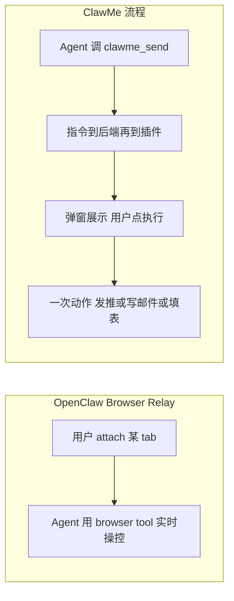

# ClawMe 浏览器工具：是什么、怎么用

面向「服务器跑 OpenClaw、自己用浏览器」的场景，用最简单的话说清楚：**这是啥、OpenClaw 里要做什么、浏览器里要做什么**。

---

## 这是什么？

**OpenClaw 能想、能聊，但不能替你动浏览器。**  
它只能在你用的 Telegram / Discord / WebChat 里**发文字和链接**，不能替你：
- 在推特/X 上**点发推**
- 在 Gmail 里**写好邮件、点发送**
- 在某个网站**填好表单、点提交**

**ClawMe 浏览器插件 = 你浏览器里的「手」。**  
OpenClaw 把「可执行指令」发到 ClawMe 后端，你的**浏览器插件**收到后，在弹窗里列出来；你点一下「执行」，插件就替你：
- **发推**：打开发推页面并预填好内容，你只需点「发推」
- **写邮件**：打开 Gmail 撰写页（或 mailto）并预填收件人/主题/正文，你只需点「发送」
- **填表单**：在当前页或指定页面按选择器填好字段，你只需点「提交」（若需要）

也就是说：**OpenClaw 负责「想和说」，ClawMe 插件负责「在你浏览器里替你点、替你填」；你保留最后一步的确认权（半自动）。**

---

## 在 OpenClaw 里要做什么？

1. **安装 ClawMe 插件**  
   让 OpenClaw 多一个 Tool：`clawme_send`，用来把指令发到 ClawMe 后端。  
   安装与配置见 [OpenClaw 接入指南](openclaw-setup.md)。

2. **配置**  
   在配置里写好 ClawMe 后端的地址和你的 **client_token**，并在 `tools.allow` 里加上 `clawme_send`。

3. **用自然语言下任务**  
   在 Telegram / WebChat 等通道里对 OpenClaw 说，例如：
   - 「帮我在推特发一条：今天天气不错」
   - 「替我写一封邮件给 alice@example.com，主题「会议提醒」，正文「明天下午 3 点开会」」
   - 「在 https://example.com/contact 这个页面帮我填一下：姓名填张三，邮箱填 zs@example.com」

OpenClaw 会调用 `clawme_send`，把对应指令（发推 / 写邮件 / 填表单）发到 ClawMe；你的浏览器插件会收到并显示。

---

## 在浏览器里要做什么？

1. **安装 ClawMe 浏览器插件**  
   Chrome：`chrome://extensions` → 开发者模式 → 加载已解压的扩展程序 → 选本仓库的 `extension` 目录。详见 [extension/README.md](../extension/README.md)。

2. **配置**  
   打开插件弹窗，填：
   - **Backend URL**：你的 ClawMe 后端地址（和 OpenClaw 里配的 `baseUrl` 一致）
   - **Token**：和 OpenClaw 里配的 **client_token** 一致

3. **收指令、点执行**  
   打开插件弹窗即可看到「待执行指令」列表。每条可以：
   - **发推**：点「执行」→ 新标签打开发推页、内容已填好 → 你点发推
   - **写邮件**：点「执行」→ 打开 Gmail 撰写或 mailto，收件人/主题/正文已填好 → 你点发送
   - **填表单**：点「执行」→ 若指令带了 URL 会先打开该页，约 2 秒后自动填；否则在当前标签页填（请先打开目标页面再点执行）。填好后你检查并点提交即可。

**总结**：  
- **OpenClaw 端**：安装插件、配 token、用自然语言说「发推/写邮件/填表单」。  
- **浏览器端**：安装插件、配同一 token、在弹窗里点「执行」完成发推/写邮件/填表单。

---

## 为什么这些事 OpenClaw 不好做？

| 事情 | OpenClaw 为啥难做 | ClawMe 怎么做 |
|------|-------------------|----------------|
| **发推** | 只能发文字/链接，不能替你登录 X 并点「发推」 | 打开发推 intent 页并预填内容，你在自己已登录的浏览器里点一下发推 |
| **发邮件** | 不能访问你的 Gmail，不能代发 | 打开撰写页或 mailto，预填 to/subject/body，你点发送 |
| **填网站表单** | 只能给链接和文字，不能往输入框里填 | 插件在当前页/指定页按选择器填好字段，你点提交 |

ClawMe 不替你「登录」或「绕过验证」——所有操作都在**你已经打开、已登录的浏览器**里完成，你保留最后一步确认，适合「提醒 + 一键到位」的用法。

---

## 与 OpenClaw 自带的 Chrome 扩展有何不同？

OpenClaw 自带 **Chrome Extension (browser relay)**：你在某个标签页上点扩展图标「attach」后，Agent 通过 **browser** Tool **实时控制这一页**（点击、输入、导航）。文档形容是 *"giving the model hands on your browser"*。

| 维度 | OpenClaw Browser Relay | ClawMe 浏览器插件 |
|------|------------------------|-------------------|
| **交互方式** | 先由你 attach 某 tab → Agent **持续操控**该页（CDP 实时控制） | Agent 下指令 → 指令进队列 → 弹窗**列出** → 你**点一条执行一条** |
| **发推 / 写邮件 / 填表单** | 需先打开对应页面并 attach，再由 Agent 在页面上点、填 | 直接下发「发推」「写邮件」「填表单」指令，插件打开发推页 / 撰写页 / 填好字段，你点一下完成 |
| **是否必须先打开某 tab** | 是，且需手动 attach | 否，不要求你先打开或 attach 任何页面 |

概念上可以这么区分：

- **OpenClaw relay**：适合「Agent 代你操作**当前已打开**的页面」——先 attach，再持续控制。
- **ClawMe**：适合「发推、写邮件、填表单」等**明确一次动作**，且不要求你先打开某 tab；指令到 → 你确认 → 执行一次。

结论：两者可以并存。要用「Agent 实时控当前页」时用 OpenClaw 扩展；要用「下一条指令、弹窗里点执行、打开发推/写邮件/填表单」时用 ClawMe。
