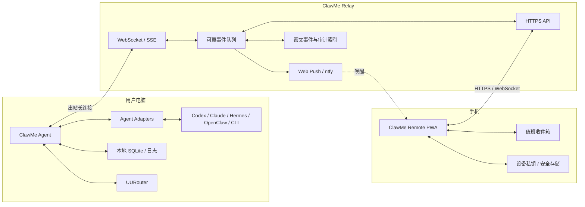

# ClawMe｜AI 值班台 v0.3 产品与技术方案

> 状态：产品与架构基线（后续实现的单一真相源）  
> 日期：2026-07-24  
> 适用仓库：`dongsheng123132/clawme`  
> 产品口号：**AI 干活，需要你时才叫你。**

---

## 1. 一句话定义

ClawMe 是一个以手机为主要交互端、跨模型与跨 Agent 的 AI 远程值班台。

它不把整块电脑屏幕搬到手机上，而是把 AI 工作现场压缩成少数需要人处理的决定：

1. AI 干完了，通知手机。
2. AI 卡住了，把原因和现场发给手机。
3. AI 需要授权，在手机上允许一次或拒绝。
4. 模型限速、额度不足或报错时，选择等待、切换模型或暂停。
5. 必要时补充一句指令，AI 在原任务上下文中继续。

核心价值不是“远程看电脑”，而是“离开电脑后，仍然能让 AI 持续工作”。

---

## 2. 产品定位

### 2.1 推荐品牌结构

| 层级 | 名称 | 说明 |
|---|---|---|
| 主品牌 | ClawMe | 跨 Agent、跨设备的统一品牌 |
| 中文名 | 虾秘 | 强调 AI 与人的私人值班助理 |
| 产品名 | ClawMe 值班台 | 手机端产品与用户认知 |
| 电脑端 | ClawMe Agent | 安装在 Windows/macOS 的常驻程序 |
| 手机端 | ClawMe Remote | PWA，后续升级原生 App |
| 模型路由 | UURouter | 提供模型配置、健康检查、限额识别和故障切换 |
| 安装分发 | U-Claw / 虾盘 | 安装 Agent、运行时、适配器和配对工具 |

### 2.2 与传统远程桌面的关系

UU 远程、向日葵、TeamViewer 的核心是“传输画面和输入”。ClawMe 的核心是“传输任务状态、审批请求和人的决定”。

因此，ClawMe 不应在首版投入：

- 低延迟视频流；
- 4K/高帧率桌面编码；
- 虚拟键鼠和游戏手柄；
- 自建 NAT 穿透和全球链路；
- 完整文件管理器和远程桌面协议。

远程桌面只作为兜底：

- 手机看不懂 AI 的摘要时，点击“打开远程桌面”；
- 通过系统已安装的 UU 远程、向日葵、RDP 或 Tailscale 深链接进入；
- ClawMe 自己不在 v0.3 重造远程桌面。

### 2.3 真正的竞争边界

官方 Codex Remote 和 Claude Code Remote Control 已覆盖各自产品内部的手机继续会话、通知和审批。因此 ClawMe 的长期壁垒必须同时具备：

- 跨 Agent：Codex、Claude Code、Hermes、OpenClaw、Kimi CLI、普通终端任务；
- 跨模型：OpenAI、Anthropic、Kimi、MiniMax、GLM、Qwen 等；
- 跨任务：一个手机收件箱统一管理多台电脑和多个会话；
- 自动恢复：模型异常后不是只提示报错，而是能选择路由并断点续干；
- 本地生态：与 U-Claw 安装、UURouter 路由、虾盘 API 服务形成闭环；
- 中文用户体验：非开发者也能看懂风险、状态和下一步。

---

## 3. GitHub 同类项目调研

本节记录 2026-07-24 的调研结论。引用项目用于学习架构和产品取舍，不代表复制其代码。

### 3.1 [Happy](https://github.com/slopus/happy)

定位：Claude Code 与 Codex 的手机/Web 客户端。

值得学习：

- 使用 CLI 包装器启动 Agent；
- 手机和电脑之间快速接管会话；
- 权限或错误触发推送；
- 端到端加密；
- App、CLI、Agent、Relay 四层拆分。

需要避开的限制：

- 用户必须改用 `happy claude` / `happy codex` 启动；
- 包装器方案容易与上游 CLI 版本变化耦合；
- 重点仍是“远程使用某个编码会话”，不是跨任务值班和模型恢复。

ClawMe 结论：保留“包装启动”作为方便入口，但不能把它作为唯一接入方式。

### 3.2 [Happier](https://github.com/happier-dev/happier)

定位：支持多 Agent 的移动/Web/桌面客户端，提供端到端加密、自托管、统一收件箱、模型控制和多机器管理。

值得学习：

- 全局 Inbox 聚合权限请求、用户问题和未读会话；
- Relay、Machine Daemon、UI/App 三层架构；
- 智能通知准确跳转到指定服务器和会话；
- 会话级模型、模式、推理强度和权限控制；
- 多服务器身份隔离；
- 持久会话、排队消息、运行中 steer/interrupt；
- 配额与模型状态监测。

需要避开的限制：

- 功能面非常大，已经接近完整 AI 开发工作台；
- Git、文件、终端、协作、语音、团队等会显著拖慢首版；
- 容易让 ClawMe 丢失“值班台”这个最容易被理解的入口。

ClawMe 结论：学习它的收件箱、Daemon 和安全路由，但首版只做值班闭环。

### 3.3 [Clay](https://github.com/chadbyte/clay)

定位：Claude Code/Codex 的自托管多人 Web 工作区。

值得学习：

- Claude 使用 Agent SDK，Codex 使用 `codex app-server` JSON-RPC；
- 在上层建立供应商无关的 Adapter；
- HTTP/WebSocket 服务与 PWA Push；
- 权限请求、错误、完成事件触发推送；
- 会话以 JSONL/Markdown 形式落盘，容易审计和迁移。

ClawMe 结论：这是 ClawMe v0.3 最重要的技术参考。原生协议优先，终端模拟只做兜底。

### 3.4 [CloudCLI / Claude Code UI](https://github.com/siteboon/claudecodeui)

定位：手机和桌面可用的完整 Web IDE，带会话、终端、文件、Git、浏览器和插件系统。

值得学习：

- 自动发现已有会话；
- 会话管理和恢复；
- 插件化扩展不同 Agent；
- 云端环境可在电脑关闭后继续运行。

不建议首版照做：

- 文件编辑器、Git Explorer、内置浏览器和完整终端属于“大而全工作台”；
- 手机上呈现过多开发细节，会削弱值班体验。

ClawMe 结论：任务详情允许查看摘要、关键日志和产物，但不做完整 IDE。

### 3.5 [MobileCLI](https://github.com/MobileCLI/mobilecli)

定位：手机实时控制 Claude Code、Codex、Gemini CLI 和普通终端。

值得学习：

- Rust 常驻 Daemon；
- PTY 会话管理与字节级终端流；
- WebSocket 协议；
- 跨平台自动启动；
- Agent 等待状态解析；
- 扫码配对和设备密钥；
- 原生手机凭证安全存储。

限制：

- PTY 文本解析容易受上游 TUI 改版影响；
- 终端流对普通手机用户信息密度过高；
- 直接网络连接要求局域网、Tailscale 或开放端口。

ClawMe 结论：PTY 是普通命令行和不支持 Hook/SDK 的 Agent 的通用兜底，不用于 Codex/Claude 的核心授权链路。

### 3.6 [ClawWork](https://github.com/clawwork-ai/ClawWork)

定位：OpenClaw 的任务化工作空间。

值得学习：

- 一个任务对应一个隔离会话；
- 把进度、工具调用和产物从聊天记录中抽离；
- 后台任务完成、审批和断线分别通知；
- 每任务可切换 Agent 和模型；
- 本地保存任务、消息和产物。

ClawMe 结论：手机首页必须以“任务”和“待处理事项”为中心，不能继续使用“指令列表 + 聊天记录”的结构。

### 3.7 [AgentAPI](https://github.com/coder/agentapi)

定位：把多种编码 Agent 的终端包装成统一 HTTP/SSE API。

值得学习：

- 小型统一 API；
- `/messages`、`/message`、`/status`、`/events` 足以覆盖通用会话；
- 单文件/单进程部署思路；
- 多 Agent 类型适配。

风险：

- 通过终端快照差异和按键模拟解析会话；
- Agent TUI 更新后可能出现错误识别；
- 很难可靠表达结构化权限、模型信息和风险。

ClawMe 结论：可以参考其通用 Adapter，但不能通过模拟键盘“自动点确认”承接高风险授权。

### 3.8 [OpenACP](https://github.com/Open-ACP/OpenACP) 与 [acp-adapter](https://github.com/beyond5959/acp-adapter)

定位：通过 Agent Client Protocol 统一不同 Agent 的会话层。

值得学习：

- 统一 Agent 会话和客户端协议；
- Codex 走 app-server；
- Claude 走机器可读 stream-json/SDK；
- 为未来接入新 Agent 减少定制代码。

ClawMe 结论：内部事件协议应保持可映射到 ACP，但 v0.3 不等待所有 Agent 原生支持 ACP。

### 3.9 [tap-to-tmux](https://github.com/flavio87/tap-to-tmux)

定位：监视 tmux 内的 AI Agent，用 ntfy 等渠道推送，并一键打开对应终端。

值得学习：

- ntfy 适合快速验证手机推送；
- 通知去重、冷却时间和“正在查看时不通知”很重要；
- 通知必须包含机器、项目、会话和最后状态；
- 深链接应直接进入对应任务，而不是只打开首页。

ClawMe 结论：v0.3 可以用 ntfy 做推送通道，但批准动作必须回到已登录的 ClawMe 页面确认，不能把长期 Token 放进通知 URL。

### 3.10 调研后的总原则

1. 原生事件优先：Codex app-server/Hooks、Claude Hooks/SDK。
2. 统一 Adapter：上层只认识 ClawMe Event，不认识各家私有格式。
3. PTY 兜底：普通命令和暂未适配的 Agent 仍可接入。
4. 值班台优先：先做好 Inbox、任务状态和审批，不做完整 Web IDE。
5. 推送只负责叫人：敏感决定回到 ClawMe 的认证页面完成。
6. 端到端身份绑定：不能继续使用一个可复制的永久 Token 代表所有设备。
7. 模型切换必须诚实：能热切换就热切换；不能热切换时，从已记录检查点创建恢复会话，不能声称“原会话无缝切换”。

---

## 4. 目标用户与核心场景

### 4.1 第一目标用户

- 同时使用 Codex、Claude Code、Hermes、OpenClaw 的个人用户；
- 会让 AI 在电脑上运行 10 分钟到数小时任务的人；
- 经常离开电脑，但希望 AI 不因一个权限弹窗停几个小时的人；
- 使用 U-Claw、UURouter 或虾盘模型服务的用户；
- 不想在手机小屏幕上操作完整 Windows 桌面的人。

### 4.2 四条必须跑通的主流程

#### 流程 A：任务完成

1. Agent 产生 `task.completed`。
2. ClawMe Agent 生成不超过三行的结果摘要。
3. 手机收到普通优先级通知。
4. 点击进入任务详情，查看结果、改动、测试和产物。
5. 用户可选择“继续下一步”或“结束任务”。

#### 流程 B：等待输入

1. Agent 产生 `attention.input_required`。
2. 手机显示问题、上下文和建议选项。
3. 用户选择选项或输入补充指令。
4. 原会话继续运行。

#### 流程 C：请求授权

1. 原生 Adapter 收到权限请求并暂停 Agent。
2. ClawMe 将命令、路径、网络目标、变更范围和风险摘要发送到手机。
3. 用户选择“允许一次”或“拒绝”。
4. 决定使用一次性、限时、绑定请求 ID 的签名票据返回。
5. Adapter 将决定交还原 Agent，任务继续或安全终止。

v0.3 不提供“永远允许”和“允许整个会话”，先把风险控制在最小范围。

#### 流程 D：模型异常

1. Adapter 或 UURouter 识别限速、额度不足、认证失败、服务不可用。
2. 任务进入 `blocked.model`，而不是简单标记失败。
3. 手机显示：
   - 当前模型；
   - 错误类型；
   - 是否建议等待；
   - 可用替代模型；
   - 上次安全检查点。
4. 用户选择：
   - 等待后重试；
   - 换模型继续；
   - 暂停；
   - 结束任务。
5. UURouter 执行路由变更；Adapter 根据能力热切换或从检查点恢复。

---

## 5. 手机端信息架构

### 5.1 首页：值班台

首页只保留三组信息：

1. **需要我处理**
   - 请求授权；
   - 等待输入；
   - 模型异常；
   - 需要人工确认的结果。
2. **正在工作**
   - 任务名；
   - Agent/模型；
   - 当前步骤；
   - 已运行时间；
   - 最后心跳。
3. **最近完成**
   - 结果摘要；
   - 成功/失败；
   - 产物数量；
   - 完成时间。

### 5.2 底部导航

| 页面 | 用途 |
|---|---|
| 值班 | 默认首页，集中处理需要人的事项 |
| 任务 | 全部进行中、暂停、失败和完成任务 |
| 对话 | 给指定任务补充指令，不做无上下文的通用聊天 |
| 设备 | 电脑在线状态、Agent、UURouter 和版本 |
| 我的 | 通知、安静时段、安全、配对和服务器设置 |

### 5.3 授权卡片

授权卡片必须显示：

- 哪台电脑；
- 哪个项目；
- 哪个 Agent；
- 请求执行什么；
- 工作目录或目标 URL；
- 会产生什么影响；
- 风险等级；
- 请求何时过期；
- 原始详情展开区；
- “允许一次”“拒绝”两个主动作。

禁止使用模糊按钮，例如只有“确定/取消”。

### 5.4 模型异常卡片

显示：

- 当前模型与提供商；
- 错误分类；
- 建议等待时间；
- 候选模型的可用状态、速度、价格和能力；
- 是否可以原会话切换；
- 若需恢复，会从哪个检查点开始。

---

## 6. 系统架构



### 6.1 ClawMe Agent

职责：

- Windows/macOS 常驻；
- 自动发现已安装 Agent；
- 创建、附加、停止和恢复会话；
- 统一转换事件；
- 本地保存任务和检查点；
- 与 Relay 保持出站连接；
- 网络断开后补传；
- 承接手机决定并交还 Agent；
- 与 UURouter 同步模型状态。

v0.3 实现建议：

- 继续使用 TypeScript，复用现有 Node 生态；
- 由 U-Claw 携带 Node 运行时并安装为常驻任务；
- 协议和产品稳定后，再评估 Go/Rust 单文件 EXE；
- 不要为追求“一个 EXE”延误首个闭环。

### 6.2 Agent Adapter

统一接口建议：

```ts
interface AgentAdapter {
  kind: "codex" | "claude" | "hermes" | "openclaw" | "terminal";
  discover(): Promise<DiscoveredSession[]>;
  attach(sessionId: string): Promise<void>;
  start(input: StartTaskInput): Promise<SessionHandle>;
  send(sessionId: string, message: string): Promise<void>;
  decide(requestId: string, decision: ApprovalDecision): Promise<void>;
  interrupt(sessionId: string): Promise<void>;
  resume(sessionId: string, checkpoint?: string): Promise<void>;
  switchModel?(sessionId: string, model: string): Promise<SwitchResult>;
  events(): AsyncIterable<ClawMeEvent>;
}
```

优先级：

1. Codex：`codex app-server` JSON-RPC + PermissionRequest Hook；
2. Claude Code：Hooks；需要深度控制时接 Agent SDK；
3. OpenClaw：Gateway WebSocket / Hook / 插件；
4. Hermes：优先查原生事件和会话接口；
5. Terminal：PTY + 退出码 + 可配置状态检测。

### 6.3 Relay

现有内存 Map 必须替换为可靠存储。

v0.3 建议：

- SQLite 起步；
- WAL 模式；
- 每个事件有全局 ID 和设备内递增序号；
- 幂等写入；
- 客户端确认 ACK；
- 断线重放；
- 事件过期和清理策略；
- WebSocket 实时送达，SSE 作为兼容通道；
- 推送只含最少摘要与任务 ID。

多用户和高并发出现后再迁移 PostgreSQL，不在首版提前复杂化。

### 6.4 PWA 与推送

v0.3 先发布 PWA：

- Web Push 可用时使用 VAPID；
- 中国大陆或系统限制场景可使用 ntfy 作为补充通道；
- 推送点击只打开对应任务；
- 任何批准都在 PWA 内重新认证并提交；
- Service Worker 不保存长期审批凭证；
- PWA 不再依赖前台 30 秒轮询。

---

## 7. 统一事件协议

### 7.1 六个用户事件

```text
task.completed          ✅ 任务完成
attention.input_required 🙋 等待输入
approval.requested      🔐 请求授权
task.failed             ❌ 执行失败
model.rate_limited      ⏳ 模型限速
model.quota_exhausted   💰 额度不足
```

内部还需要：

```text
task.started
task.progress
task.paused
task.resumed
task.cancelled
session.message
session.checkpoint
approval.resolved
model.switched
agent.connected
agent.disconnected
machine.heartbeat
artifact.created
```

### 7.2 事件信封

```json
{
  "event_id": "evt_01...",
  "sequence": 1042,
  "schema_version": 1,
  "type": "approval.requested",
  "occurred_at": "2026-07-24T14:30:00+08:00",
  "user_id": "usr_...",
  "machine_id": "mac_...",
  "task_id": "tsk_...",
  "session_id": "ses_...",
  "agent": {
    "kind": "codex",
    "version": "..."
  },
  "model": {
    "provider": "openai",
    "name": "..."
  },
  "summary": "Codex 请求运行 npm install",
  "payload_encrypted": "...",
  "requires_attention": true,
  "expires_at": "2026-07-24T14:35:00+08:00"
}
```

### 7.3 授权请求

解密后的 payload：

```json
{
  "request_id": "apr_...",
  "kind": "command",
  "reason": "需要联网下载并修改依赖目录",
  "command": "npm install",
  "cwd": "C:\\Projects\\UURouter",
  "risk": {
    "level": "medium",
    "network": true,
    "writes_files": true,
    "destructive": false,
    "targets": ["package-lock.json", "node_modules"]
  },
  "available_decisions": ["allow_once", "deny"]
}
```

### 7.4 人的决定

```json
{
  "decision_id": "dec_...",
  "request_id": "apr_...",
  "task_id": "tsk_...",
  "decision": "allow_once",
  "decided_at": "2026-07-24T14:31:12+08:00",
  "device_id": "phn_...",
  "nonce": "...",
  "signature": "..."
}
```

Agent 必须检查：

- 请求仍处于 pending；
- 未过期；
- request/task/machine 全部匹配；
- nonce 未使用；
- 手机设备仍处于授权状态；
- 签名有效。

---

## 8. 数据模型

| 实体 | 关键字段 |
|---|---|
| users | id、账号、状态 |
| devices | id、user_id、kind、public_key、push_handle、last_seen |
| machines | id、user_id、name、os、agent_version、online |
| agent_installations | machine_id、kind、version、capabilities |
| projects | id、machine_id、name、path_hash、display_path |
| tasks | id、project_id、title、status、priority、created_at、finished_at |
| sessions | id、task_id、agent_kind、native_session_id、model、status |
| events | id、sequence、task_id、type、ciphertext、occurred_at、acked_at |
| attention_requests | id、task_id、kind、status、expires_at |
| decisions | id、request_id、device_id、decision、signature、decided_at |
| checkpoints | id、session_id、kind、native_ref、summary、created_at |
| artifacts | id、task_id、kind、name、local_ref、preview |
| model_profiles | id、provider、model、route、capabilities、health |
| audit_log | actor、action、target、result、occurred_at、hash |

本地数据库保存完整现场；云 Relay 默认只保存路由元数据和加密 payload。

---

## 9. 安全基线

### 9.1 配对

淘汰当前“Backend URL + 永久 Token”二维码。

新流程：

1. 电脑生成一次性配对码；
2. 配对码 60 秒过期，只能使用一次；
3. 手机生成设备密钥对；
4. 双方展示相同的短验证码；
5. 用户在电脑或已绑定设备确认；
6. Relay 只保存设备公钥和撤销状态。

二维码不发送到第三方二维码生成服务，必须本地生成。

### 9.2 授权

- 默认拒绝；
- v0.3 只支持允许一次和拒绝；
- 所有请求有明确过期时间；
- 决定绑定 request ID、task ID 和 machine ID；
- 已解决或已过期的请求不能重放；
- 高风险详情必须可展开；
- 不模拟点击原 Agent 的“确定”按钮；
- 通过原生 Hook/SDK/app-server 返回决定。

### 9.3 数据

- 长期密钥不放 `localStorage`；
- 原生 App 使用系统 Keychain/Keystore；
- PWA 使用 WebCrypto 生成不可导出密钥并结合设备会话；
- Relay 日志不得记录 Token、完整命令输出和源码；
- 敏感 payload 端到端加密；
- 推送正文只显示用户配置允许的摘要；
- 审计记录采用哈希链，避免静默篡改。

### 9.4 失联策略

- 手机无响应：到期自动拒绝；
- Relay 失联：Agent 保持暂停，不自动批准；
- Agent 重启：从本地数据库恢复 pending 请求；
- 同一请求多设备同时决定：服务器只接受第一个合法决定；
- 模型切换失败：保持原任务为 blocked，不丢弃检查点。

---

## 10. UURouter 模型切换协议

### 10.1 错误分类

```text
rate_limited
quota_exhausted
authentication_failed
provider_unavailable
model_unavailable
context_exceeded
policy_rejected
network_failed
unknown
```

### 10.2 候选模型评分

UURouter 返回：

- 是否在线；
- 最近错误率；
- 预计等待时间；
- 价格；
- 上下文长度；
- 工具调用能力；
- 是否兼容当前 Agent；
- 是否支持当前任务所需能力；
- 用户余额或套餐状态。

### 10.3 切换等级

| 等级 | 行为 |
|---|---|
| L0 | 当前会话原生支持切换，直接切换 |
| L1 | 同一 Agent 新建会话，注入原会话摘要和检查点 |
| L2 | 切换 Agent，由 ClawMe 生成标准交接包 |
| L3 | 无安全恢复路径，只允许等待、暂停或人工接管 |

交接包至少包含：

- 原始目标；
- 已完成步骤；
- 未完成步骤；
- 修改过的文件；
- 测试结果；
- 当前 Git 状态；
- 最近错误；
- 禁止重复的副作用操作；
- 用户已作出的授权决定。

---

## 11. MVP 范围

### 11.1 v0.3 必须有

- Windows ClawMe Agent 常驻运行；
- Codex Adapter；
- Claude Code Adapter；
- 普通命令行任务 Adapter；
- 本地 SQLite；
- Relay 可靠事件与 ACK；
- WebSocket/SSE；
- 手机 PWA 值班首页；
- Web Push 或 ntfy 通知；
- 任务完成、等待输入、授权、失败四种闭环；
- 手机允许一次/拒绝；
- 补充指令；
- 设备扫码配对；
- 审计日志；
- UURouter 模型异常展示和人工选择；
- 旧 `clawme_send` 协议兼容。

### 11.2 v0.3 明确不做

- 自研远程桌面；
- 完整手机文件编辑器；
- 手机 Git 客户端；
- 多人团队协作；
- 企业 SSO/RBAC；
- 自动批准高风险动作；
- 完整语音助手；
- 自动选择模型并静默切换；
- Android/iOS 原生 App；
- 多区域高可用云架构。

---

## 12. 实施阶段

### 阶段 0：协议和安全地基

目标：先避免在旧 instruction 结构上继续堆功能。

- 定义 Task、Session、Event、AttentionRequest、Decision；
- 建立事件版本号和能力协商；
- 本地生成一次性二维码；
- 设计设备密钥和签名决定；
- 保留 `/v1/instructions` 作为兼容接口。

验收：

- 同一事件重复发送不会产生两条任务；
- 决定不能重放；
- 服务重启后 pending 请求仍存在。

### 阶段 1：电脑 Agent + 本地任务中心

- 新增 `agent/`；
- 安装为 Windows 常驻任务；
- SQLite；
- 心跳和断线补传；
- Terminal Adapter；
- 本地诊断命令。

验收：

- 重启电脑后自动上线；
- 启动普通命令可在手机看到 running/completed/failed；
- Relay 断网 10 分钟后恢复，事件不丢不重。

### 阶段 2：Codex 手机授权闭环

- 接入 app-server 与 PermissionRequest；
- 显示命令、路径、网络目标和风险；
- 手机允许一次/拒绝；
- turn 完成、失败、计划进度和 diff 摘要。

验收：

- Codex 在授权点真实暂停；
- 手机决定后继续；
- 不使用键盘模拟；
- 已过期决定被拒绝。

### 阶段 3：Claude Code 与 OpenClaw

- Claude Hooks；
- 深度控制需要时接 Agent SDK；
- OpenClaw Gateway/插件事件；
- 统一 Inbox。

验收：

- 三种 Agent 在手机上使用同一任务卡片和授权卡片；
- Adapter 私有字段不会泄漏到 UI。

### 阶段 4：UURouter 换模型继续

- 错误分类；
- 候选模型健康与额度；
- L0-L3 切换策略；
- 检查点与交接包；
- 手机人工选择。

验收：

- 真实模拟限速和额度不足；
- 用户可选择等待、切换、暂停；
- 切换后不重复已产生副作用的步骤。

### 阶段 5：发布

- U-Claw 安装集成；
- Windows 安装/升级/卸载；
- PWA 发布；
- 线上 Relay 数据迁移；
- 旧 Chrome 插件兼容；
- 灰度用户测试；
- 文档、隐私政策和故障恢复手册。

---

## 13. 验收指标

### 13.1 可靠性

- 任务事件送达率 ≥ 99.9%；
- 重连后事件不丢失；
- 审批请求重复率 < 0.1%；
- 重启后 pending 请求恢复率 100%；
- 手机决定到 Agent 恢复的中位耗时 < 2 秒。

### 13.2 体验

- 从安装到手机配对 < 3 分钟；
- 用户不看原始日志也能理解 80% 的授权请求；
- 首页三秒内看懂“谁在干活、谁卡住、需要我做什么”；
- 通知点击后直接进入对应任务；
- 完成通知可配置合并，避免消息轰炸。

### 13.3 安全

- Relay 不持有可直接执行审批的长期 Token；
- 二维码无永久凭据；
- 决定全部可审计；
- 拒绝和超时不会导致任务误继续；
- 任何自动化模型切换均不能绕过原权限边界。

---

## 14. 现有仓库迁移建议

| 现有目录 | 处理方式 |
|---|---|
| `backend/` | 升级为 Relay；用可靠存储替换内存 Map |
| `web/` | 重构为任务/Inbox 型 PWA；保留官网 |
| `extension/` | 保留浏览器执行能力，降级为 ClawMe 的一个设备 Adapter |
| `openclaw-clawme/` | 从单向 `clawme_send` 扩展为会话和事件接入 |
| `ios/` | 暂停首版投入；等 PWA 验证后再恢复 |
| `docs/` | 本文档作为 v0.3 单一真相源 |
| `deploy/` | 保留 Cloudflare Tunnel，补数据库备份和迁移 |
| 新增 `agent/` | 电脑常驻端、Adapter、本地 SQLite、诊断与安装 |

兼容原则：

- 现有 `/v1/instructions` 不立即删除；
- 旧 Chrome 扩展仍可使用；
- 新系统通过 compatibility adapter 把旧 instruction 映射为 task event；
- 新 PWA 不再读取旧 `target=browser` 队列；
- 线上迁移前先做数据与协议双写验证。

---

## 15. 产品决策记录

### D-001：ClawMe 不做通用远程桌面

原因：远程桌面是重资产赛道，且不是 ClawMe 最独特的价值。

### D-002：手机端以 Inbox 和任务为中心

原因：长任务、授权、错误和多 Agent 无法被一条聊天时间线清晰表达。

### D-003：原生 Adapter 优先，PTY 兜底

原因：权限决定必须可靠地映射到原 Agent 请求，不能依赖 TUI 文本和模拟按键。

### D-004：首版只允许一次或拒绝

原因：减少授权范围扩张和误操作；持久规则等审计数据稳定后再做。

### D-005：先 PWA，后原生 App

原因：先验证值班闭环、通知价值和用户频率，再承担 App Store 与双端维护成本。

### D-006：换模型不承诺绝对无缝

原因：不同 Agent 和模型的会话格式不同。ClawMe 应明确展示是热切换还是检查点恢复。

### D-007：云 Relay 默认最小可见

原因：代码、命令和对话属于高敏数据；路由层不应天然拥有读取全部内容的权限。

---

## 16. 最终产品表达

### 对用户

> 电脑上的 AI 继续干活。  
> 完成、卡住、要授权、模型出问题时，ClawMe 才叫你。

### 对开发者

> One attention inbox for every local AI agent.

### 与 UU 远程的差别

> UU 远程让手机控制电脑。  
> ClawMe 让手机管理电脑上的 AI。

### 与官方远程功能的差别

> 官方客户端管理自己的 Agent。  
> ClawMe 管理你所有电脑、所有 Agent 和所有模型。

