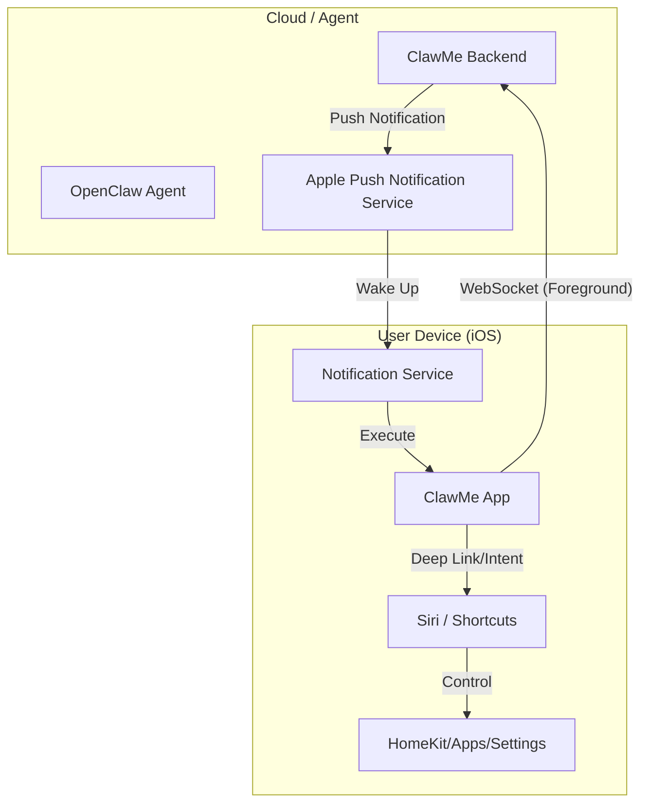

# ClawMe iOS Feasibility Analysis & Architecture Plan

## 1. Executive Summary
**Verdict: Highly Feasible (with specific architectural choices)**

The vision described in `网上看到的.md` (Voice Control, Dashboard, Remote Execution) is achievable on iOS, but **Apple's strict background execution rules** require a specific technical approach. We cannot simply run a "Node.js server" or "Python script" in the background 24/7.

## 2. Core Feature Feasibility

### A. Voice Wake / "Hey ClawMe" (语音唤醒)
**Challenge**: iOS does **not** allow third-party apps to listen to the microphone continuously in the background for a wake word (privacy & battery).
**Solution**:
1.  **Siri Integration (Recommended)**: Use **SiriKit (Intents)**. User says "Hey Siri, Ask ClawMe to [command]".
2.  **Foreground Listening**: When the app is open (or in "StandBy" mode while charging), we can keep the mic open for "Hey ClawMe".
3.  **Action Button**: On iPhone 15/16 Pro, map the Action Button to "Start Listening" for instant access.

### B. Background Execution & Remote Control
**Challenge**: Apps are suspended shortly after minimizing. WebSockets will disconnect.
**Solution**:
1.  **Push Notifications (APNs)**: The "Server" sends a **Silent Push** (`content-available: 1`) to wake the app.
2.  **Notification Service Extension**: The app wakes up in the background for ~30 seconds to process the command.
3.  **Critical Alerts**: For urgent notifications, we can play sounds even in Do Not Disturb (requires special entitlement).

### C. Controlling Other Apps & Phone
**Challenge**: iOS App Sandbox prevents direct control of other apps (no `adb shell` equivalent).
**Solution**: **Shortcuts Integration (App Intents)**.
*   ClawMe exposes actions to Shortcuts.
*   Shortcuts has deep system access (HomeKit, Alarm, Reminders, Open App, URL Scheme).
*   **Workflow**: Agent -> ClawMe App -> Trigger Shortcut -> Action.

### D. Dashboard / Visuals
**Verdict**: **100% Feasible**.
*   **SwiftUI** for beautiful, responsive dashboards.
*   **Widgets**: Put the "Status Dashboard" directly on the Home Screen.
*   **Live Activities**: Show real-time task progress on the Lock Screen / Dynamic Island.

## 3. Proposed Architecture

## 4. Development Roadmap (Revised)

### Phase 1: The Foundation (Week 1-2)
*   **Tech**: Swift (SwiftUI) + Network Framework.
*   **Feature**: Basic App Shell. Connects to `clawme-backend`.
*   **Capabilities**: Receive text command -> Show notification / Simple Alert.

### Phase 2: Shortcuts & Actions (Week 3-4)
*   **Tech**: App Intents Framework.
*   **Feature**: Expose `ExecuteCommand` to Shortcuts.
*   **Capabilities**: Agent can trigger any iOS Shortcut (e.g., "Good Morning Scene", "Text Mom").

### Phase 3: Voice & widget (Week 5-8)
*   **Tech**: Speech framework, WidgetKit.
*   **Feature**: "Talk Mode" (Foreground voice chat). Home Screen Widgets.

## 5. Recommendation
**Go Native.** Do not use Flutter/React Native for this. We need deep access to:
*   App Intents (Shortcuts)
*   Live Activities
*   Background Tasks
*   SiriKit

Swift is the only viable choice for a "System Level" agent interface.
